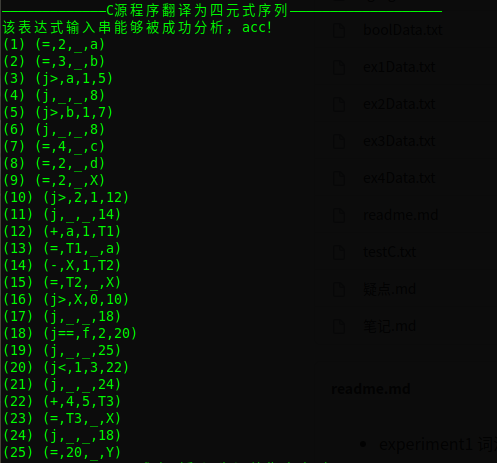
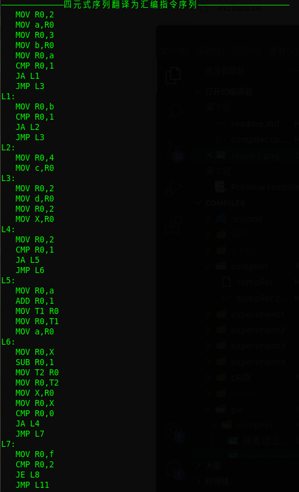
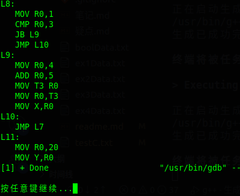

# 简要介绍
* experiment1：词法分析。
* experiment2：对LL1文法分别使用递归下降文法和预测分析法。
* experiment3：构造优先函数和优先分析表识别表达式。
* experiment4：构造LR1分析表，对赋值表达式进行语法制导翻译。
* LR族：
  给定一文法，自动构造LR0、SLR、LR1、LALR分析表，构造过程可视化。
* compiler：
  涵盖C语言文法中的算术运算文法、赋值文法、布尔运算文法、if、while、do-while和复合语句文法，并使用构造的LALR分析表，对C语言源程序进行语法制导翻译，中间代码以四元式形式给出，并翻译为汇编代码。

# 特点
1. experiment2中构造LL1文法的预测分析表时，自动生成非终结符的first集和follow集
2. experiment4中构造文法的LR1分析表，是根据龙书实现的，因此experiment4可以取出构造LR1分析表的部分单独用来生成任意文法的LR1分析表
3. compiler利用文法的LALR分析表进行语法制导翻译

# 语法制导展示
* 待翻译C源程序
```C
{
    a = 2;
    b = 3;
    if(a>1 && b>1)
        c = 4;
    d = 2;
    X = 2;
    do
    {
        if(2>1)
            a = a+1;
        X = X - 1;
    }while(X>0);

    while(f==2)
    {
        if(1<3)
            X = 4+5;
    };
    Y = 20;
}#
```
* 翻译为四元式
<br>

* 翻译为汇编代码
<br>

